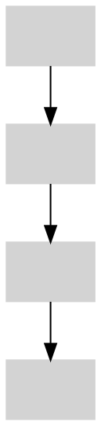

# GraphViz+Markdown via mnb

In this example `mnb` realizes some smartness out of Markdown and GraphViz.

Generator looks through Markdown files and tries to identify images which should be generated from GraphViz .dot files.

For example, if there is a reference to image fig01.png, and there is a file fig01.dot,
then fig01.png would be generated from fig01.dot.

```markdown

```


## Inline GraphViz

If an image reference is immediately followed by code section with language `dot`,
dot code is extracted and transformed into image




## External GraphViz as Image Definition

![fig03]

[fig03]: generated/fig03.png

## Inline GraphViz as Image Definition

If inline GraphViz code follows an image definition, it would be extracted to generate the image

![fig04]

[fig04]: generated/inline-example-2.png


## Options

"Creative use" of Markdown [link reference definitions](https://spec.commonmark.org/current/#link-reference-definition) to specify options


Subdirectory to store generated images 
```markdown
[mnb-graphviz:generated_dir]: generated
```

[mnb-graphviz:generated_dir]: generated

